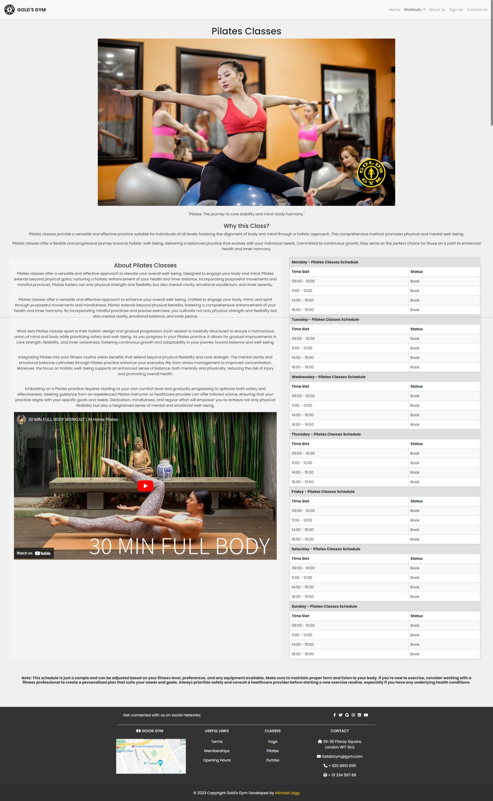

# Gold's Gym
[Gold's Gym](https://codelegg.github.io/Bootstrap-Website/) is a well-known chain of fitness centers and gyms. It was founded in 1965 by [Joe Gold](https://en.wikipedia.org/wiki/Joe_Gold_(bodybuilder)) in Venice Beach, California, and has since become one of the most recognizable and iconic names in the [fitness industry](https://en.wikipedia.org/wiki/Fitness_center).

At **Gold's Gym**, we provide a comprehensive fitness experience where members can access vital information about our facility, get to know our dedicated staff, and immerse themselves in the state-of-the-art fitness environment we offer.

## Home Page
<!--  -->
***

- **Technologies used**

- HTML
- CSS
- Javascript
- Font Awesome icons
- Google fonts
***

- **User Stories**

- As a first-time visitor, I want to understand the website, so I can learn more about the gym.

- As a first-time visitor, I want to be able to easily navigate through the website, so I can find the information I am looking for.

- As a first-time visitor, I want to see information about the gym's facilities, so I can learn more about what's available.

- As a first-time visitor, I want to see information about the gym's trainers and staff, so I can learn more about them and their expertise.

- As a first-time visitor, I want to see some images or descriptions of equipment and materials used in the gym, so I can become familiar with the offerings.

- As a member of the gym, I want the website to have a gallery section, so I can view photos from gym events, workouts, and activities.

- As a user, I want the website to have a contact page with a form, so I can easily get in touch with the gym for inquiries or feedback.

- As a mobile device user, I want the website to be responsive, so I can access and use it effectively on my smartphone or tablet.

***

## Features

#### Home Page

###### Navigation

- Positioned at the top of the page.
- Contains the Gold's Gym logo at the left corner.
- At the right side, there are navigation links:
  
  - **Home:** Leads to the home page.
  - **Workouts:** Leads to the virtual tour page.
  - **About Us:** Leads to the About Us section.
  - **Sign Up:** Leads to the Sign Up section.
  - **Contact:** Leads to the Contact section.

***
**Hero Section**

- Hero section has a sliding carousel of three images.
- Hero section shows the text block at the left side of the screen:

  - It has a welcome message for each slide.
  - It welcomes the user and provides button options to:
    - 'Get started'
    - 'Learn More'
    - ''Get Involved'
  - Each Button Links to a different part of the wesbite, encouraging you to join.
    -  Get started' takes you to the [Memberships](https://codelegg.github.io/Bootstrap-Website/memberships.html)

    - 'Learn More' takes you to the [Workouts](https://codelegg.github.io/Bootstrap-Website/workouts.html)

    - 'Get Involved' takes you to the [Upper/Lower](https://codelegg.github.io/Bootstrap-Website/upper-lower.html)

***
- **About Us Section**
  
  - Image (Right) / (Center in tablet/mobile view)
  - Information about the Gym (left)
  - Breif About Golds Gym History

***
- **CTA Hero Section**
  
  - CTA Hero section has a sliding carousel of three images.
    - It Invites the user and provides options to:
    - 'Get started'
  - Each Button Links to a the sign-up part of the wesbite, encouraging you to join.

***
**Contact Section** 

-  Contact Us Form (left)
- Image (Right) / (Center and below in tablet/mobile view)
   

  
  - **Become Familiar With Our Audio Squares Section**
    
    - Three Squares with quotes and audio buttons
    - Icons
    - Click button for sound

***
- **Footer**
  
  - Social media links
  - Map
  - Links to Pages
    - [Terms](https://codelegg.github.io/Bootstrap-Website/terms.html)
    - [Memberships](https://codelegg.github.io/Bootstrap-Website/terms.html)
    - [Opening Hours](https://codelegg.github.io/Bootstrap-Website/terms.html)
  - Contact Information
  - Copyright sign with company name with my GitHub link
    [Github](https://github.com/CodeLegg)

***

- **Workout Page & Pages**
  - ***Workout Page***
  - Workout hero section has a sliding carousel of three images.
  - Workout hero section shows the text block at the left side of the screen:

  - It has a welcome message for each slide.
  - It welcomes the user and provides button options to:
    - 'Get Intouch'
    - 'Learn More'
    - 'Get Involved'
  - Each Button Links to a different part of the wesbite, encouraging you to join.
    -  Get started' takes you to the [Contact Us](https://codelegg.github.io/Bootstrap-Website/index.html#contact)
    - 'Learn More' takes you to the [Opening Hours](https://codelegg.github.io/Bootstrap-Website/openinghours.html)
    - 'Get Involved' takes you to the [Yoga](https://codelegg.github.io/Bootstrap-Website/yoga.html)

***
  ***Workout Pages***

  - ***Workout Page Push Pull Legs***
      - Image picture at the top
      - Why this Programme? Explaing why its good for you. 
      - About the Workout - Breif Description of workout
      - Table - Table of workouts you could use.
      - Video - A video helping you understand the workout.

  
  - ***Workout Page 3-1-3***
      - Image picture at the top
      - Why this Programme? Explaing why its good for you. 
      - About the Workout - Breif Description of workout
      - Table - Table of workouts you could use.
      - Video - A video helping you understand the workout.
  

  
  - ***Workout Page Full-Body***
      - Image picture at the top
      - Why this Programme? Explaing why its good for you. 
      - About the Workout - Breif Description of workout
      - Table - Table of workouts you could use.
      - Video - A video helping you understand the workout.

  
  - ***Workout Upper/lower***
      - Image picture at the top
      - Why this Programme? Explaing why its good for you. 
      - About the Workout - Breif Description of workout
      - Table - Table of workouts you could use.
      - Video - Two videos helping you understand the workout.

  
  - ***Workout Cardio***
      - Image picture at the top
      - Why this Programme? Explaing why its good for you. 
      - About the Workout - Breif Description of workout
      - Table - Table of workouts you could use.
      - Video - A video helping you understand the workout.

  
  - ***Workout Bro Split***
      - Image picture at the top
      - Why this Programme? Explaing why its good for you. 
      - About the Workout - Breif Description of workout
      - Table - Table of workouts you could use.
      - Video - A video helping you understand the workout.

  
  - ***Workout Page Yoga***
      - Image picture at the top
      - Why this Programme? Explaing why its good for you. 
      - About the Workout - Breif Description of workout
      - Table - Table of workouts you could use.
      - Video - A video helping you understand the workout. 
      

  
  - ***Workout Page Pilates***
       - Image picture at the top
      - Why this Programme? Explaing why its good for you. 
      - About the Workout - Breif Description of workout
      - Table - Table of workouts you could use.
      - Video - A video helping you understand the workout.
  
  
  
  - ***Workout Page Zumba***
      - Image picture at the top
      - Why this Programme? Explaing why its good for you. 
      - About the Workout - Breif Description of workout
      - Table - Table of workouts you could use.
      - Video - A video helping you understand the workout.

  
  ***

### Sign Up

- **Sign Up Page/Form**
  - Logo at top of card
  - Form to sign up to the gym
  - Thank you message once signign up
 

  ***
### Mobile View

- **Hamburger Menu**
  - Logo
  - Home (Active)
  - School Tour
  - Gallery
  - Contact

- **Hero Section**
  - Animated background image
  - School name
  - Message about the school
  - Glowing button

- **About Us Section**
  - Image (Top)
  - Information about the school
  - Why choose our school

- **Meet Our Team Section**
  - Three teacher cards (Stacked)
    - Photo of teacher
    - Brief introduction
  - Animated hover effect

- **Become Familiar With Our Materials Section**
  - Flashcards with fruit images
    - Picture
    - Hover: Name of fruit and audio

- **Footer**
  - Social media links (animated hover)
  - Copyright sign with GitHub link

## School Tour Page

### Desktop & Mobile View

- **Navigation Bar**
  - Same as Home Page

- **Hero Section**
  - Different background image
  - Text about virtual tour

- **Tour Sections**
  - Our main hall
    - Picture
    - Description
  - Our classroom
    - Picture
    - Description
  - Our canteen
    - Picture
    - Description
  - Our art zone
    - Picture
    - Description
  - Buttons to scroll between sections

- **Footer**
  - Same as Home Page

## Gallery Page

### Desktop & Mobile View

- **Navigation Bar**
  - Same as Home Page

- **Gallery**
  - Pictures of school activities
  - Hover effect (slight scaling)

- **Footer**
  - Same as Home Page

## Contact Page

### Desktop & Mobile View

- **Navigation Bar**
  - Same as Home Page

- **Contact Form**
  - Customized text input fields
  - Animated labels on focus
  - Customized radio buttons
  - Animated submit button on hover
  - Thank you message on form submission

- **Footer**
  - Same as Home Page

---

Feel free to use this template to create your wireframes for the Starlight English website. You can adapt it to your specific design and layout preferences.